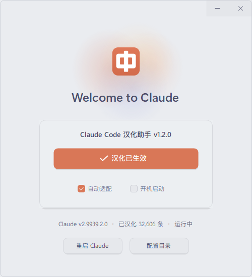

<div align="center">
  
  <h1>Claude Code 桌面版中文助手</h1>
  <p>面向 Windows / macOS (Apple Silicon) 的 Claude Desktop / Claude Code 极简外挂式界面汉化伴侣</p>
</div>

**Claude Code 桌面版中文助手**（CC 中文助手 / `CCZhAssistant`）是一个专为 Claude Desktop 及 Claude Code 桌面环境打造的非官方外挂式汉化伴侣程序。它采用与官方程序隔离的安全部署方式，不修改核心签名与二进制执行逻辑，不破坏 Cowork 沙箱及工作区功能，支持一键应用全中文界面，并随时可一键无损还原官方原版。

---

## 客户端下载与使用

### Windows 用户使用

1. 从 [Releases](https://github.com/CX-ArtLab/CC-zh-assistant/releases/latest) 下载最新版本的 `CCZhAssistant-windows.zip`。
2. 将 ZIP 解压到任意文件夹。无需安装开发环境，也不需要将 EXE 放入 Claude 安装目录。
3. 运行解压后的 `CCZhAssistant.exe`。
4. 点击主卡片中的 **“立即应用汉化”** 胶囊按钮即可一键完成汉化。
5. 汉化生效后，点击下方的 **“重启 Claude”** 按钮即可一键重启客户端刷新界面。
6. 助手支持“自动适配”、“开机启动”和“后台静默守护”，可随 Windows 启动并驻留系统托盘。

> **便携版程序**：本程序为单文件绿色免安装应用，移动整个解压文件夹即可移动助手，卸载时在助手内点击恢复原版后直接删除该文件夹即可。

### macOS 用户使用（Apple Silicon）

1. 从 [Releases](https://github.com/CX-ArtLab/CC-zh-assistant/releases/latest) 下载最新版本的 `CCZhAssistant-macOS-apple-silicon.zip`。
2. 双击解压得到 `CCZhAssistant-macOS-apple-silicon.app`，将其拖入 **“访达 (Finder) -> 应用程序 (/Applications)”** 中。
3. 双击运行助手，点击 **“立即应用汉化”**。应用完成后若 Claude 处于运行状态，点击 **“重启 Claude”** 即可体验完整中文界面。
4. 如需开机自启或同步最新词典，勾选界面中的“开机启动”与“自动更新”即可。

> **Gatekeeper 安全提示**：由于开源程序未购买昂贵的 Apple 开发者企业签名证书，若首次打开弹出安全提示，可前往 **“系统设置 -> 隐私与安全性”** 点击 **“仍要打开”**；或在终端中执行：
> ```bash
> xattr -cr /Applications/CCZhAssistant-macOS-apple-silicon.app
> ```

<div align="center">
  
</div>

---

## 当前功能特性

- **跨平台原生支持**：同时提供 Windows 原生高性能单文件客户端与 macOS (Apple Silicon M1/M2/M3/M4) 原生 SwiftUI 伴侣客户端。
- **非破坏性外挂伴侣**：不改写核心数字签名与二进制逻辑，保障 Cowork 沙箱及工作区完全可用。
- **一键应用与一键还原**：自动备份原始配置，随时可一键完美还原至官方原版英文状态。
- **海量词典预置**：内置打包 32,600+ 条官方界面与交互词条（涵盖前端、会话、设置、侧边栏、快捷键与模型选项等，全面人工清洗机翻痕迹）。
- **极简居中卡片美学**：采用现代化无边框沉浸式视窗，结合高精度矢量抗锯齿绘制与 DPI 自适应防挤压方案（多尺度高分屏均清晰锐利）。
- **智能版本检测与自动适配**：实时监测 Claude Desktop 进程状态与版本升级，检测到新版本后自动增量适配。
- **待适配词条扫描器**：自动比对官方英文词库与现有汉化，未翻译的新增词条自动输出到用户配置目录下的 `待适配词条.json`，方便社区贡献与后续补充。
- **独立词典云端更新**：支持热更新远程词典包，无需频繁重新下载助手客户端。
- **便捷一键重启**：界面内置“重启 Claude”快捷按钮，优雅关闭旧进程并秒级重新拉起，无需手动任务管理器/终端清理。

---

## 兼容性与运行环境

| 平台 | 操作系统支持 | 适用芯片 / 架构 | 软件版本要求 |
| :--- | :--- | :--- | :--- |
| **Windows** | Windows 10 / 11（64 位） | x64 / ARM64 (兼容层) | 官方 Claude Desktop (MSIX 应用商店版或普通免打包版) |
| **macOS** | macOS 12 Monterey 及更高 | Apple Silicon (M1/M2/M3/M4) | 官方 Claude Desktop for Mac |

---

## 本地编译构建

### Windows 版本编译

在 Windows PowerShell 中运行：

```powershell
.\build.ps1
```

生成的单文件便携程序位于 `dist/CCZhAssistant.exe`，并会自动打包生成 `dist/CCZhAssistant-windows.zip`。项目使用 Windows 自带的 .NET Framework C# 编译器（`csc.exe`），无需安装 Visual Studio、.NET SDK、Node.js 或 Python 等额外开发环境。

### macOS 版本编译

在 macOS 终端中运行：

```bash
bash macOS/build-macos.sh
```

脚本会自动使用 Swift Package Manager（`swift build`）编译原生 Apple Silicon 可执行文件，组装包含图标和内嵌资源的 `.app` 应用程序包，并生成便携分发文件 `dist/CCZhAssistant-macOS-apple-silicon.zip`。

---

## 词典包说明

- 翻译词典源文件位于 [`translation/`](translation/)：
  - `translation-pack.json`：打包的完整词典集合（包含前端、桌面、交互与补充词条）。
  - `manifest.json`：词典版本控制与云端更新元数据。
- 发布版会直接把构建时的完整词典内嵌打包进应用，完全离线即可使用。
- 开启“自动更新”后，程序会自动检测并优先加载用户数据目录中的最新更新词典。

---

## 隐私与免责声明

1. **隐私安全**：助手仅处理 Claude 官方应用程序的系统界面元素与语言配置，绝不读取、修改或上传您的对话记录、提示词、代码片段或项目私有文件。扫描出的待适配词条仅保存在本机。
2. **非官方声明**：本项目不是 Anthropic 官方产品，与 Anthropic PBC 不存在任何隶属、赞助或授权关系。“Claude”、“Claude Code”及相关商标和品牌资源均归其各自权利人所有。
3. **开源许可**：本项目基于 MIT 许可证开源，仅供学习、交流与界面便利使用。
